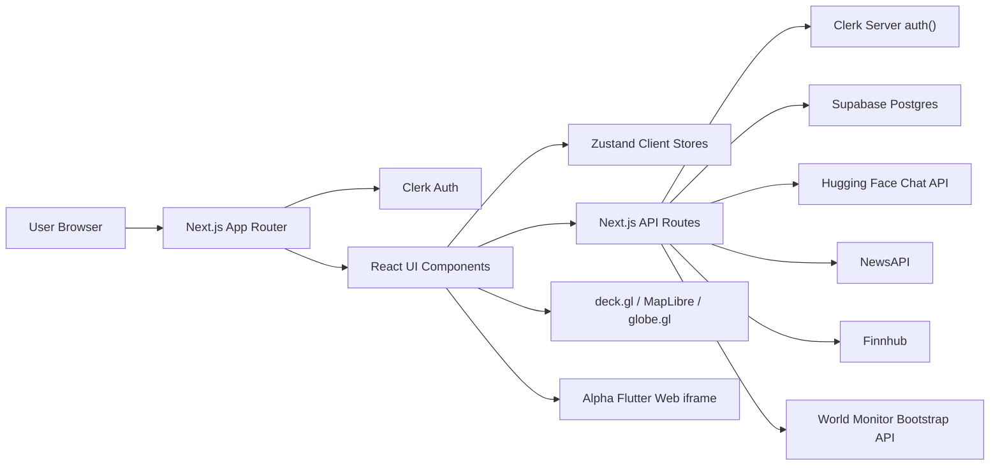
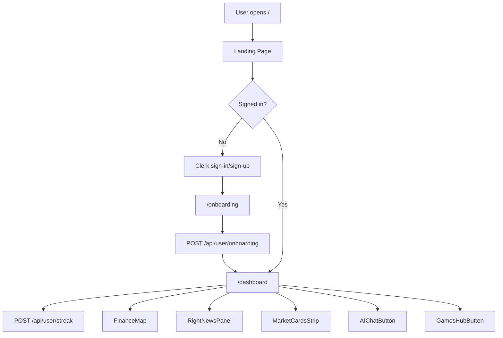
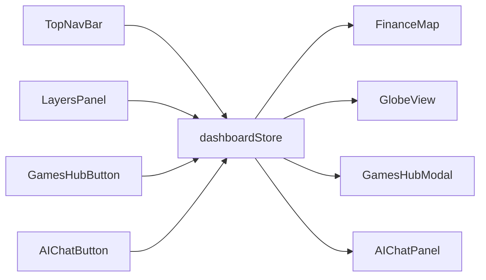
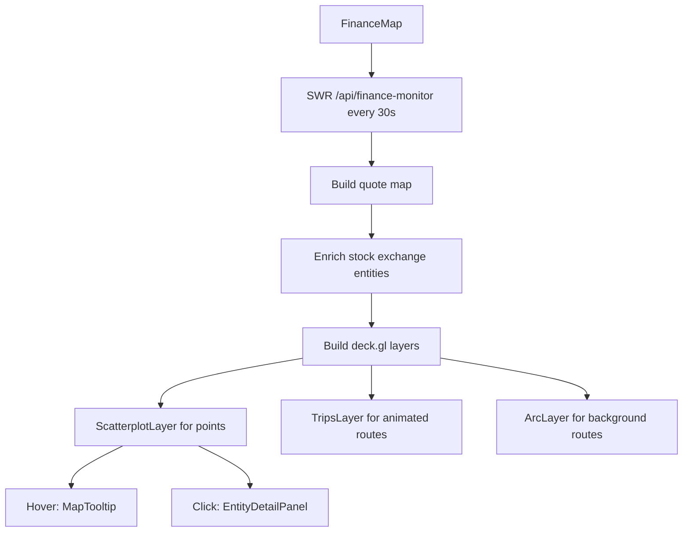
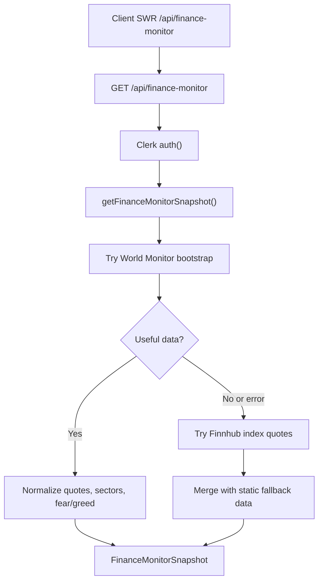
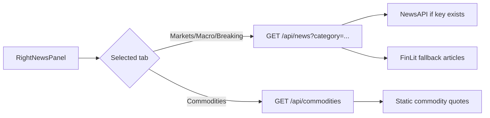
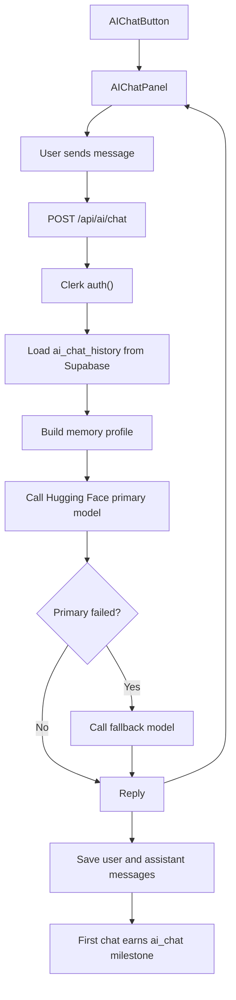
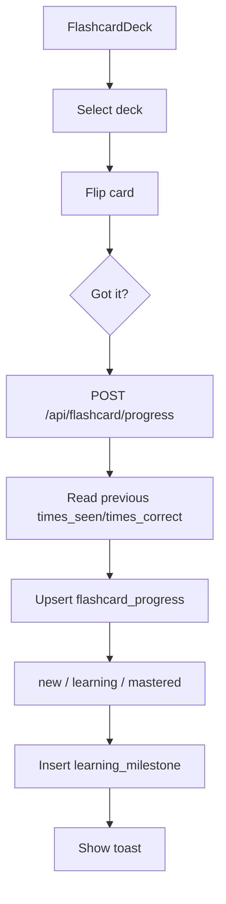
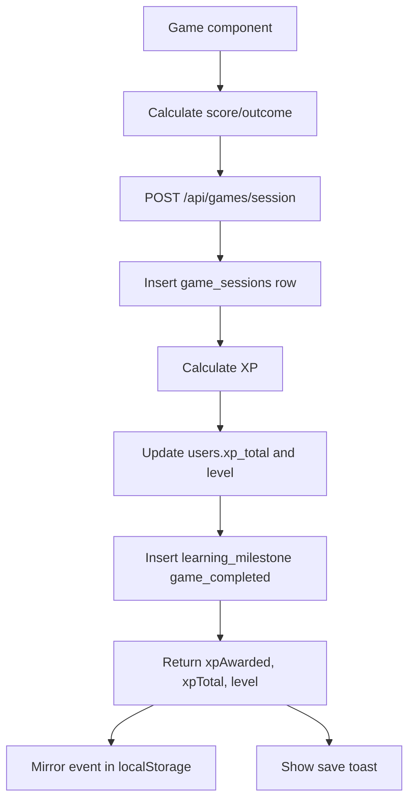
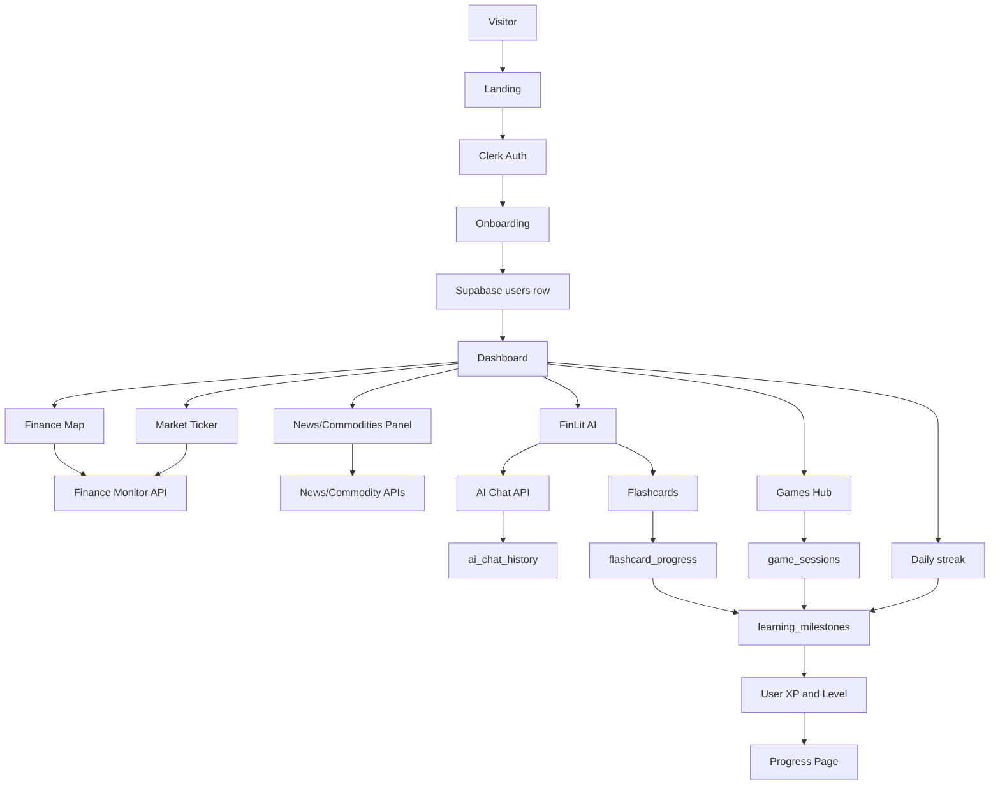

# FinLit Project Documentation and Flow

This document explains how the FinLit project is organized, how the application runs, how data moves through the system, and how the main user flows work.

## 1. Project Purpose

FinLit is a financial literacy web app. It combines:

- A live-style global finance map.
- Market, commodity, crypto, sector, and news panels.
- Clerk-based authentication.
- Supabase persistence for users, XP, streaks, game sessions, flashcards, AI chat history, news interactions, and watchlists.
- A FinLit AI coach powered by Hugging Face chat completions.
- Flashcards and progress tracking.
- A games hub with React finance games plus an embedded Alpha Flutter game.

The project also contains:

- `alpha/`: a Flutter finance board game source tree.
- `_worldmonitor_ref/`: a reference World Monitor project used for attribution and design/API inspiration. It is not the main runtime app.

## 2. Runtime Architecture



### Main Layers

| Layer | Main Files | Responsibility |
|---|---|---|
| App shell | `src/app/layout.tsx` | Wraps the whole app in `ClerkProvider` and global CSS. |
| Route protection | `src/proxy.ts` | Protects dashboard, onboarding, API, games, AI, user, news, markets, commodities, and finance-monitor routes. |
| Landing | `src/app/page.tsx` | Public home page with auth-aware CTA. |
| Dashboard shell | `src/app/dashboard/layout.tsx` | Builds the top nav, map area, right news panel, bottom ticker, AI button, and toast viewport. |
| Dashboard map | `src/app/dashboard/page.tsx` | Renders the full-bleed finance map plus layers and filters. |
| Client state | `src/store/dashboardStore.ts` | Stores active layers, map scope, 2D/3D mode, time range, modal state, XP, and level. |
| Toasts | `src/store/toastStore.ts` | Stores short-lived UI notifications. |
| API routes | `src/app/api/**/route.ts` | Authenticated server endpoints for markets, AI, games, user progress, etc. |
| Supabase clients | `src/lib/supabase/*.ts` | Browser, server, and service-role Supabase clients. |
| Finance monitor | `src/lib/worldmonitor/finance.ts` | Normalizes World Monitor data and falls back to Finnhub/static data. |

## 3. Top-Level Request Flow



## 4. Authentication Flow

FinLit uses Clerk for identity and route protection.

1. The root layout wraps all pages in `ClerkProvider`.
2. `src/proxy.ts` protects:
   - `/dashboard`
   - `/games`
   - `/onboarding`
   - `/api/ai`
   - `/api/user`
   - `/api/games`
   - `/api/flashcard`
   - `/api/news`
   - `/api/markets`
   - `/api/commodities`
   - `/api/finance-monitor`
3. Protected server routes call `auth()` again before returning data or mutating Supabase.
4. Clerk user IDs are used as the Supabase `users.id` value.
5. Supabase service-role access is restricted to server route handlers through `src/lib/supabase/admin.ts`.

## 5. Page and UI Flow

### Public Landing Page

File: `src/app/page.tsx`

The landing page shows:

- FinLit branding.
- A short product promise.
- Stats for exchanges, feeds, and games.
- A sign-in CTA for logged-out users.
- A dashboard link for logged-in users.
- A demo modal placeholder.

### Onboarding

File: `src/app/onboarding/page.tsx`

Onboarding has three steps:

1. Five finance quiz questions calculate a knowledge score.
2. User selects learning goals.
3. User selects a game preference.

On submit, the client posts to:

```text
POST /api/user/onboarding
```

The API upserts a row into `users` with:

- Clerk user ID.
- Email.
- Display name.
- Avatar URL.
- Financial knowledge level.
- Learning goals.
- Game preference.
- `onboarding_completed = true`.
- `last_login_at`.

After success, the user is routed to `/dashboard`.

### Dashboard Shell

File: `src/app/dashboard/layout.tsx`

The dashboard layout creates a fixed application shell:

- `TopNavBar`: brand, live indicator, region selector, UTC clock, time range pills, 2D/3D toggle, games button, Clerk user button.
- Main map area: rendered by child routes.
- `RightNewsPanel`: news and commodities side panel.
- `MarketCardsStrip`: bottom ticker using finance-monitor data.
- `AIChatButton`: floating assistant entry point.
- `ToastViewport`: app notifications.

### Dashboard Page

File: `src/app/dashboard/page.tsx`

On mount, the page posts to:

```text
POST /api/user/streak
```

That updates the user's daily streak and XP. Then it renders:

- `FinanceMap`
- `LayersPanel`
- `MapFilters`

## 6. Dashboard State Flow

File: `src/store/dashboardStore.ts`

The dashboard state is held in Zustand.



State fields:

| State | Purpose |
|---|---|
| `activeMapLayers` | Controls visible map layers. |
| `mapScope` | Selected geography scope in the top nav. |
| `mapViewMode` | Switches between 2D map and 3D globe. |
| `timeRange` | Selected time range pill. |
| `isGamesHubOpen` | Opens/closes the games hub modal. |
| `isAIChatOpen` | Opens/closes the AI chat panel. |
| `userXP`, `userLevel` | Shows XP and level inside games UI. |

## 7. Finance Map Flow

Main files:

- `src/components/map/FinanceMap.tsx`
- `src/components/map/GlobeView.tsx`
- `src/components/map/LayersPanel.tsx`
- `src/components/map/EntityDetailPanel.tsx`
- `src/components/map/MapTooltip.tsx`
- `src/data/mapLayers.ts`
- `src/data/stockExchanges.ts`

### Map Data Sources

Static data:

- `stockExchanges`
- `financialCenters`
- `otherMapEntities`
- `TRADE_ROUTES`
- `CHOKEPOINTS`
- `LAYER_CONFIG`

Live/enriched data:

- `/api/finance-monitor`

### 2D Map Flow



The 2D map uses:

- `DeckGL`
- `ScatterplotLayer`
- `TripsLayer`
- `ArcLayer`
- `MapLibreMap`
- Carto dark matter basemap.

### 3D Globe Flow

If `mapViewMode === "3d"`, `FinanceMap` renders `GlobeView` instead of `DeckGL`.

The same active layers, point entities, trip data, and animation time are passed into the globe view.

### Layer Filtering

`LayersPanel` reads `activeMapLayers` from Zustand and toggles layers with `toggleLayer`.

Layer groups:

- Infrastructure: undersea cables, pipelines, trade routes, chokepoints.
- Finance: stock exchanges, financial centers, central banks, commodity hubs, GCC investments.
- Events: natural events, internet disruptions, weather alerts.

## 8. Finance Monitor Data Flow

Main files:

- `src/app/api/finance-monitor/route.ts`
- `src/lib/worldmonitor/finance.ts`
- `src/types/financeMonitor.ts`



Response shape:

- `source`: `worldmonitor`, `finnhub-alpha`, or `fallback`.
- `updatedAt`.
- `missing`.
- `marketQuotes`.
- `commodityQuotes`.
- `cryptoQuotes`.
- `gulfQuotes`.
- `sectors`.
- `fearGreedIndex`.

Used by:

- `FinanceMap` for entity enrichment.
- `MarketCardsStrip` for the bottom ticker.
- `FinanceMonitorPanel` if rendered.

## 9. News and Commodity Flow

Main files:

- `src/components/dashboard/RightNewsPanel.tsx`
- `src/components/dashboard/NewsCard.tsx`
- `src/app/api/news/route.ts`
- `src/app/api/commodities/route.ts`



News route behavior:

- Requires Clerk auth.
- Caches per category for 60 seconds in memory.
- Uses `NEWS_API_KEY` when configured.
- Falls back to built-in FinLit articles.

Commodity route behavior:

- Requires Clerk auth.
- Caches for 5 minutes in memory.
- Currently returns fallback commodity quotes.

When a user spends enough time on a news item, `POST /api/user/news-interaction` can save an interaction and award a learning milestone.

## 10. AI Coach Flow

Main files:

- `src/components/ai/AIChatButton.tsx`
- `src/components/ai/AIChatPanel.tsx`
- `src/components/ai/FlashcardDeck.tsx`
- `src/app/api/ai/chat/route.ts`
- `src/app/api/ai/learning-plan/route.ts`

### Chat Flow



The AI route builds a teaching-focused system prompt and a memory prompt from recent stored and client-provided messages.

Memory signals include:

- Apparent learning level.
- Current topic.
- Relevant recent context.
- Preferred analogy styles.
- Recurring finance interests.
- Teaching style signals.

If `HUGGINGFACE_API_KEY` is missing, the route returns a configured fallback message instead of failing.

### Learning Plan Flow

`POST /api/ai/learning-plan` returns a simple plan based on provided gaps and goals:

- Review a flashcard deck.
- Play Budget Blitz.
- Ask FinLit AI a related question.

## 11. Flashcard Flow

Main files:

- `src/components/ai/FlashcardDeck.tsx`
- `src/data/flashcards.ts`
- `src/app/api/flashcard/progress/route.ts`



Status rules:

- `mastered`: `times_correct >= 5`.
- `learning`: seen more than once.
- `new`: first exposure.

XP milestones:

- Seen card: 2 XP.
- Mastered card: 10 XP.

## 12. Games Flow

Main files:

- `src/components/games/GamesHubButton.tsx`
- `src/components/games/GamesHubModal.tsx`
- `src/components/games/BudgetBlitzGame.tsx`
- `src/components/games/CompoundClickerGame.tsx`
- `src/components/games/MarketMayhemGame.tsx`
- `src/components/games/PaperTradingGame.tsx`
- `src/components/games/AlphaGame.tsx`
- `src/components/games/Leaderboard.tsx`
- `src/app/api/games/session/route.ts`
- `src/app/api/leaderboard/route.ts`
- `src/lib/gamesXpStorage.ts`

### Games Hub

The games hub opens from the top nav. When opened, it fetches:

```text
GET /api/user/xp
```

It displays the current level and XP, then lets users play:

- Alpha: external Flutter Web game embedded through iframe.
- Budget Blitz: budgeting allocation challenge.
- Compound Clicker: compounding simulation.
- Market Mayhem: news/sector allocation challenge.
- Paper Trader: virtual portfolio trading challenge.
- Leaderboard.

### Game Completion Flow



Server XP formula:

```text
xp = max(25, min(100, round(score / 15))) + 50 if outcome is win
```

The client also records game XP in local storage under:

```text
finlit:games-xp:<normalized-email>
```

This gives the UI a local fallback record of recent game XP events.

### Leaderboard

`GET /api/leaderboard?game=<game_name>` reads top scores from `game_sessions`, joins `users`, and returns the top 10 rows.

## 13. Progress Flow

Main file:

- `src/app/dashboard/progress/page.tsx`

The progress page is a server component. It reads:

- User XP, level, streak, and goals from `users`.
- Mastered flashcard count from `flashcard_progress`.
- Game count and recent game history from `game_sessions`.
- Deck progress from `flashcard_progress`.
- Total available cards from `src/data/flashcards.ts`.

It displays:

- Level and XP progress bar.
- Flashcards mastered.
- Games played.
- Streak.
- Estimated learning time.
- Flashcard progress by deck.
- Knowledge gap analysis.
- Recent game history table.

## 14. User, XP, and Streak Flow

### User XP

Main route:

```text
GET /api/user/xp
POST /api/user/xp
```

`GET` returns the current `xpTotal` and `level`.

`POST`:

1. Reads current `xp_total`.
2. Adds `xpAmount`.
3. Computes level with `levelFromXP`.
4. Updates `users`.
5. Inserts a `learning_milestones` row.

Level formula:

```ts
Math.floor(Math.pow(Math.max(xp, 0) / 100, 1 / 1.5)) + 1
```

### Daily Streak

Main route:

```text
POST /api/user/streak
```

On dashboard load:

1. Reads `last_login_at`, `streak_days`, and `xp_total`.
2. Compares last login day to current UTC day.
3. Same day: no extra XP.
4. One-day difference: increments streak.
5. Larger gap: resets streak to 1.
6. Awards 10 daily XP for a new day.
7. Awards milestone XP at 7-day and 30-day streaks.
8. Updates `users`.
9. Inserts a `daily_login` milestone if XP was awarded.

## 15. Watchlist Flow

Main route:

```text
GET /api/user/watchlist
POST /api/user/watchlist
DELETE /api/user/watchlist
```

Behavior:

- `GET`: returns all watchlist rows for the signed-in user.
- `POST`: upserts a symbol and asset type.
- `DELETE`: removes a symbol for the signed-in user.

Symbols are normalized to uppercase.

## 16. Supabase Data Model

The code expects these tables:

| Table | Purpose | Main Fields Used |
|---|---|---|
| `users` | User profile, progress, and onboarding state | `id`, `email`, `display_name`, `avatar_url`, `financial_knowledge_level`, `learning_goals`, `game_preference`, `onboarding_completed`, `last_login_at`, `streak_days`, `xp_total`, `level` |
| `flashcard_progress` | Per-user card mastery | `user_id`, `card_id`, `deck`, `status`, `times_seen`, `times_correct`, `last_seen_at` |
| `game_sessions` | Saved game results | `user_id`, `game_name`, `score`, `duration_seconds`, `rounds_played`, `outcome`, `metadata`, `played_at` |
| `ai_chat_history` | AI chat memory | `user_id`, `session_id`, `role`, `content`, `model_used`, `created_at` |
| `news_interactions` | News reading behavior | `user_id`, `article_url`, `headline`, `category`, `time_spent_seconds` |
| `watchlist` | User-tracked assets | `user_id`, `symbol`, `asset_type` |
| `learning_milestones` | XP events and progress records | `user_id`, `milestone_type`, `milestone_value`, `xp_awarded`, `created_at` |

Important security expectation:

- RLS should be enabled in Supabase.
- The browser uses anon Supabase credentials only.
- Server API routes use the service role key through `getSupabaseAdmin()`.

## 17. API Inventory

| Route | Method | Auth | Purpose |
|---|---:|---|---|
| `/api/finance-monitor` | `GET` | Yes | Finance snapshot from World Monitor, Finnhub, or fallback. |
| `/api/markets` | `GET` | Yes | Market quote list with Finnhub fallback behavior. |
| `/api/commodities` | `GET` | Yes | Commodity quotes, currently static fallback with cache. |
| `/api/news` | `GET` | Yes | Category news from NewsAPI or fallback articles. |
| `/api/ai/chat` | `POST` | Yes | AI coach chat, memory, persistence, first-chat XP. |
| `/api/ai/learning-plan` | `POST` | Yes | Simple learning plan from gaps/goals. |
| `/api/flashcard/progress` | `POST` | Yes | Saves flashcard progress and milestone XP. |
| `/api/games/session` | `POST` | Yes | Saves game session and awards XP. |
| `/api/leaderboard` | `GET` | No route-level auth in handler | Returns top scores for a game. |
| `/api/user/onboarding` | `POST` | Yes | Saves onboarding profile. |
| `/api/user/streak` | `POST` | Yes | Updates daily login streak and XP. |
| `/api/user/xp` | `GET`, `POST` | Yes | Reads or updates XP and level. |
| `/api/user/watchlist` | `GET`, `POST`, `DELETE` | Yes | Manages user watchlist. |
| `/api/user/news-interaction` | `POST` | Yes | Saves article interaction and may award XP. |

Note: `src/proxy.ts` protects `/api/leaderboard` only if included in the protected matcher. The current matcher does not list `/api/leaderboard`, and the handler itself does not call `auth()`. That makes the leaderboard publicly readable.

## 18. Environment Variables

Defined in `.env.example`:

| Variable | Used For |
|---|---|
| `NEXT_PUBLIC_CLERK_PUBLISHABLE_KEY` | Clerk browser auth. |
| `CLERK_SECRET_KEY` | Clerk server auth. |
| `NEXT_PUBLIC_CLERK_SIGN_IN_URL` | Clerk sign-in route. |
| `NEXT_PUBLIC_CLERK_SIGN_UP_URL` | Clerk sign-up route. |
| `NEXT_PUBLIC_CLERK_AFTER_SIGN_IN_URL` | Redirect after sign-in. |
| `NEXT_PUBLIC_CLERK_AFTER_SIGN_UP_URL` | Redirect after sign-up. |
| `NEXT_PUBLIC_SUPABASE_URL` | Supabase project URL. |
| `NEXT_PUBLIC_SUPABASE_ANON_KEY` | Browser/server anon client key. |
| `SUPABASE_SERVICE_ROLE_KEY` | Server-only admin Supabase access. |
| `FINNHUB_API_KEY` | Market quote fallback provider. |
| `ALPHA_VANTAGE_API_KEY` | Reserved for market integrations. |
| `NEWS_API_KEY` | NewsAPI integration. |
| `HUGGINGFACE_API_KEY` | AI coach model calls. |
| `HUGGINGFACE_CHAT_ENDPOINT` | Hugging Face-compatible chat completions endpoint. |
| `HUGGINGFACE_PRIMARY_MODEL` | Primary AI model. |
| `HUGGINGFACE_FALLBACK_MODEL` | Fallback AI model. |
| `UPSTASH_REDIS_REST_URL` | Reserved for caching. |
| `UPSTASH_REDIS_REST_TOKEN` | Reserved for caching. |
| `WORLD_MONITOR_API_KEY` | Optional World Monitor bootstrap key. |
| `NEXT_PUBLIC_APP_URL` | App base URL. |

## 19. Local Development Flow

```bash
npm install
npm run dev
```

Open:

```text
http://localhost:3000
```

Build:

```bash
npm run build
```

Lint:

```bash
npm run lint
```

Minimum setup for a complete local experience:

1. Copy `.env.example` to `.env.local`.
2. Add Clerk keys.
3. Add Supabase URL, anon key, and service role key.
4. Create the expected Supabase tables with RLS.
5. Optionally add NewsAPI, Finnhub, World Monitor, and Hugging Face keys.

Without external API keys:

- Finance monitor falls back to static/live partial data.
- News falls back to built-in FinLit articles.
- Commodities return static quotes.
- AI returns a configuration message unless `HUGGINGFACE_API_KEY` is set.

## 20. Deployment Flow

The README targets Vercel deployment.

```bash
vercel
```

Deployment requirements:

- Set all env vars in Vercel.
- Confirm Clerk redirect URLs point to deployed routes.
- Confirm Supabase project RLS policies allow each user to access only their own records.
- Keep `SUPABASE_SERVICE_ROLE_KEY` server-only.
- Review `vercel.json` cross-origin headers for the Alpha iframe path.

## 21. Source Tree Guide

```text
finlit/
  src/
    app/
      page.tsx                         Public landing page
      layout.tsx                       Root Clerk/global layout
      onboarding/page.tsx              Onboarding quiz/goals/preferences
      dashboard/
        layout.tsx                     Dashboard shell
        page.tsx                       Main map screen
        progress/page.tsx              Progress dashboard
      api/                             Server route handlers
    proxy.ts                           Route protection
    components/
      ai/                              AI chat and flashcards
      dashboard/                       Top nav, news panel, ticker
      games/                           Games hub and finance games
      map/                             2D/3D finance map components
      ui/                              Shared UI primitives
    data/                              Static app data
    lib/
      supabase/                        Supabase clients
      worldmonitor/                    Finance monitor adapter
      gamesXpStorage.ts                Local game XP mirror
      utils.ts                         Shared utilities
    store/                             Zustand stores
    types/                             Shared TypeScript types
  alpha/                               Flutter Alpha game source
  docs/
    PROJECT_FLOW.md                    This document
```

## 22. End-to-End Flow Summary



## 23. Current Implementation Notes

- The dashboard currently emphasizes the global finance map as the main application surface.
- `FinanceMonitorPanel` exists but is not included in the current dashboard layout.
- `mapScope` and `timeRange` are stored globally, but most map/data filtering currently depends on active map layers and finance monitor refreshes.
- `/api/markets` exists separately from `/api/finance-monitor`; the UI primarily uses `/api/finance-monitor`.
- `UPSTASH_REDIS_*` variables are listed but current cache implementations are in-memory.
- The Alpha game is embedded from `https://finbizz-89872.web.app/`.
- The Supabase schema is described by app usage, but SQL migrations are not present in this repository.
